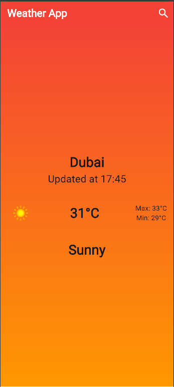

# Weather App 🌤️

A Flutter application that displays real-time weather information for different cities. It shows temperature, weather conditions, and has a simple, modern UI.

## 📱 Screenshots

### 🌧️ Heavy Rain


### 🌦️ Patchy Rain


### 🔍 Search Screen


### 🟡 Splash Screen


### ☀️ Sunny (with space)


### ☀️ Sunny (no space)


## 🔑 Features

- View current temperature and weather conditions
- Search by city name
- Display weather icons and backgrounds
- Simple and clean user interface

## 🚀 Getting Started

1. Clone the repository:
```bash
git clone https://github.com/yourusername/weather_app.git

